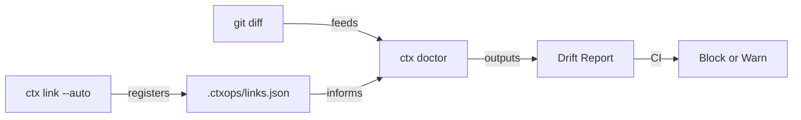

<p align="right">
  <a href="./README.zh-CN.md">🇨🇳 中文</a>
</p>

# ctxops

**The Context Integrity Engine for AI Coding Teams.**

Your AI coding tools are only as good as the context they consume. `ctxops` detects when documentation drifts from code — right in your PR — so your AI never acts on stale context.

## The Problem

AI coding tools are getting smarter, but team-level development still breaks on stale context:

- Architecture rules live in Wiki, Slack, and tribal knowledge — AI can't reach them
- Documentation rots silently — and consistently misleads AI output ([Chroma Research](https://research.trychroma.com/context-rot))
- `AGENTS.md`, `CLAUDE.md`, Copilot instructions drift apart
- Nobody knows which docs are affected when code changes

**The result**: AI generates code faster, but incident rates go up 23.5% ([Cortex 2026 Benchmark](https://www.cortex.io/post/ai-is-making-engineering-faster-but-not-better-state-of-ai-benchmark-2026)).

## Quick Start

```bash
# Initialize ctxops (generates AGENTS.md + Claude Code skill automatically)
npx ctxops init

# Auto-discover document-code links (zero config)
npx ctxops link --auto

# Detect drift in your PR
npx ctxops doctor --base main
```

## What It Does

**Detect** context drift at PR time — not after AI produces wrong output.

```bash
$ ctx doctor --base main

ctx doctor: checking context integrity against main...

Changed files: 2
Linked documents: 3
Affected documents: 2

🔴 STALE + DRIFTED  docs/ai/modules/order.md
   Last updated: 42 days ago (threshold: 30 days)
   Affected by:
     services/order/handler.ts  +15 -3

🟡 DRIFTED          docs/ai/architecture.md
   Last updated: 5 days ago
   Affected by:
     services/order/handler.ts  +15 -3

✔  SYNCED           docs/ai/modules/inventory.md
   Updated in this PR

Summary: 1 stale, 1 drifted, 1 synced, 1 unaffected
```

## How It Works

1. **Link** documents to code paths — auto-discovered or explicit
2. **Detect** which docs are affected when code changes (PR-level drift detection)
3. **Enforce** context integrity in CI with `--mode strict`



## Commands

### `ctx init`

Initialize ctxops in your git repository:

```bash
ctx init
```

Creates:
- `.ctxops/` — config directory
- `docs/ai/` — context fragment templates
- `AGENTS.md` — instructions for AI agents (Codex, Gemini CLI, etc.)
- `.claude/skills/ctxops/` — Claude Code skill (auto-loaded)

### `ctx link`

Create document-to-code associations:

```bash
ctx link --auto                    # ⭐ Auto-discover all links (zero config)
ctx link --auto --deep             # Include Layer 5 semantic matching
ctx link docs/ai/modules/order.md "services/order/**"  # Manual link
ctx link --list                    # Show all links
ctx link --remove <doc>            # Remove a link
```

#### Multi-Layer Smart Auto-Link

`ctx link --auto` uses four inference layers by default, with Layer 5 opt-in:

| Layer | Method | Default | Example |
|---|---|---|---|
| 1. `ctxops` comment | `<!-- ctxops: paths=... -->` | ✅ | Explicit, highest priority |
| 2. Convention | Directory name matching | ✅ | `modules/order.md` → `services/order/**` |
| 3. Content scan | Code paths referenced in markdown | ✅ | Doc mentions `services/inventory/service.ts` |
| 4. Git co-change | Files modified together in git history | ✅ | Statistical association from commits |
| 5. Semantic match | Class/function names grep-matched | `--deep` | Higher noise risk, opt-in |

### `ctx doctor --base <branch>`

PR-level context drift detection:

```bash
ctx doctor --base main                    # Text output (default)
ctx doctor --base main --explain          # Show why each doc was flagged
ctx doctor --base main --format json      # Machine-readable
ctx doctor --base main --format sarif     # GitHub Code Scanning
ctx doctor --base main --mode strict      # Exit 1 on drift (for CI)
ctx doctor --base HEAD --staged           # Check staged files (pre-commit)
```

If no links exist, `doctor` auto-discovers them — truly zero config.

> **Error handling**: If the base branch doesn't exist or git comparison fails, `doctor` reports an explicit error instead of silently passing. All git arguments are sanitized against injection.

### `ctx status`

Global context health overview — like `git status` for your AI context:

```bash
ctx status                         # Health overview
ctx status --coverage              # Include code directory coverage

# Output:
#   Context Health: ██████████████████████████████ 100%
#   ● Fresh: 5    ● Aging: 1    ● Stale: 0    Total: 6
#
#   ✔  docs/ai/modules/order.md        2d ago  (3 paths)
#   ◐  docs/ai/modules/inventory.md   25d ago  (2 paths)
#
#   ── Coverage ──
#   Context Coverage: ████████████████████░░░░░░░░░░ 67%
#   4/6 code directories covered
#     ✖ services/payment  ← needs context doc
```

### `ctx hook`

Manage git pre-commit hook for local checking:

```bash
ctx hook install    # Install pre-commit hook
ctx hook remove     # Remove it
ctx hook            # Check status
```

The hook uses `--staged` mode: it checks files being committed, not the full branch diff.

## AI Agent Integration

`ctx init` automatically generates instruction files for AI coding agents:

| Agent | File | How It Works |
|---|---|---|
| **Claude Code** | `.claude/skills/ctxops/SKILL.md` | Auto-loaded as skill |
| **Codex** (OpenAI) | `AGENTS.md` | Read from repo root |
| **Gemini CLI** | `AGENTS.md` | Read from repo root |
| **Cursor** | `.claude/skills/` or Rules | Reuses skill file |
| **Cline / OpenCode** | `AGENTS.md` | Read from repo root |

### Agent Workflow

```
Agent receives task: modify services/order/handler.ts
  │
  ├→ 1. Pre-code: npx ctxops doctor --base main --format json
  │     Finds order.md is drifted → reads but verifies against code
  │
  ├→ 2. Modifies code
  │
  ├→ 3. Post-code: npx ctxops doctor --base main
  │     Detects drift → auto-updates order.md
  │
  └→ 4. Single commit with code + doc update → doctor shows SYNCED ✅
```

No MCP server, no SDK, no configuration. Agents just run commands.

## CI Integration

### GitHub Actions

```yaml
name: Context Integrity
on: [pull_request]
jobs:
  check:
    runs-on: ubuntu-latest
    steps:
      - uses: actions/checkout@v4
        with:
          fetch-depth: 0
      - run: npx ctxops doctor --base ${{ github.event.pull_request.base.ref }} --mode strict
```

## Convention-First Metadata

No YAML. No frontmatter. Just write Markdown.

Metadata is **inferred** from your directory structure:

| Path | Inferred Scope |
|---|---|
| `docs/ai/modules/order.md` | `module` |
| `docs/ai/playbooks/bugfix.md` | `playbook` |
| `docs/ai/architecture.md` | `project` |

Need to override? Use an HTML comment (optional):

```markdown
<!-- ctxops: scope=module, paths=services/order/** -->

# Order Module

(Your normal markdown content — no frontmatter needed)
```

## What It Is NOT

- **Not a coding agent** — it's the layer coding agents depend on
- **Not a cloud service** — CLI-first, repo-local, version-controlled
- **Not a doc generator** — it checks integrity, not content

## Philosophy

Don't build another coding agent. Build the context integrity layer that every coding agent depends on.

## License

Apache-2.0
