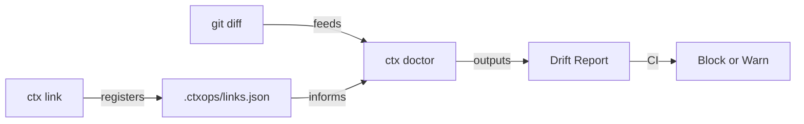

<p align="right">
  <a href="./README.zh-CN.md">🇨🇳 中文</a>
</p>

# ctxops

**The Context Integrity Engine for AI Coding Teams.**

Your AI coding tools are only as good as the context they consume. `ctxops` detects when documentation drifts from code — right in your PR — so your AI never acts on stale context.

## The Problem

AI coding tools are getting smarter, but team-level development still breaks on stale context:

- Architecture rules live in Wiki, Slack, and tribal knowledge — AI can't reach them
- Documentation rots silently — and consistently misleads AI output ([Chroma Research](https://research.trychroma.com/context-rot))
- `AGENTS.md`, `CLAUDE.md`, Copilot instructions drift apart
- Nobody knows which docs are affected when code changes

**The result**: AI generates code faster, but incident rates go up 23.5% ([Cortex 2026 Benchmark](https://www.cortex.io/post/ai-is-making-engineering-faster-but-not-better-state-of-ai-benchmark-2026)).

## Quick Start

```bash
# Initialize ctxops in your repo
npx ctxops init

# Link a doc to code paths
npx ctxops link docs/ai/modules/order.md "services/order/**"

# Detect drift in your PR
npx ctxops doctor --base main
```

## What It Does

**Detect** context drift at PR time — not after AI produces wrong output.

```bash
$ ctx doctor --base main

ctx doctor: checking context integrity against main...

Changed files: 2
Linked documents: 3
Affected documents: 2

🔴 STALE + DRIFTED  docs/ai/modules/order.md
   Last updated: 42 days ago (threshold: 30 days)
   Affected by:
     services/order/handler.ts  +15 -3

🟡 DRIFTED          docs/ai/architecture.md
   Last updated: 5 days ago
   Affected by:
     services/order/handler.ts  +15 -3

✔  SYNCED           docs/ai/modules/inventory.md
   Updated in this PR

Summary: 1 stale, 1 drifted, 1 synced, 1 unaffected
```

## How It Works

1. **Link** documents to code paths — convention-based by default, explicit when needed
2. **Detect** which docs are affected when code changes (PR-level drift detection)
3. **Enforce** context integrity in CI with `--mode strict`



## Commands

### `ctx init`

Initialize ctxops in your git repository:

```bash
ctx init
```

Creates `.ctxops/` config directory and `docs/ai/` template structure.

### `ctx link <doc> <code-paths...>`

Create document-to-code associations:

```bash
ctx link docs/ai/modules/order.md "services/order/**" "shared/models/order.ts"
ctx link --list              # Show all links
ctx link --remove <doc>      # Remove a link
```

### `ctx doctor --base <branch>`

PR-level context drift detection:

```bash
ctx doctor --base main                    # Text output (default)
ctx doctor --base main --format json      # Machine-readable
ctx doctor --base main --format sarif     # GitHub Code Scanning
ctx doctor --base main --mode strict      # Exit 1 on drift (for CI)
```

## CI Integration

### GitHub Actions

```yaml
name: Context Integrity
on: [pull_request]
jobs:
  check:
    runs-on: ubuntu-latest
    steps:
      - uses: actions/checkout@v4
        with:
          fetch-depth: 0
      - run: npx ctxops doctor --base ${{ github.event.pull_request.base.ref }} --mode strict
```

## Convention-First Metadata

No YAML. No frontmatter. Just write Markdown.

Metadata is **inferred** from your directory structure:

| Path | Inferred Scope |
|---|---|
| `docs/ai/modules/order.md` | `module` |
| `docs/ai/playbooks/bugfix.md` | `playbook` |
| `docs/ai/architecture.md` | `project` |

Need to override? Use an HTML comment (optional):

```markdown
<!-- ctxops: scope=module, paths=services/order/** -->

# Order Module

(Your normal markdown content — no frontmatter needed)
```

## What It Is NOT

- **Not a coding agent** — it's the layer coding agents depend on
- **Not a cloud service** — CLI-first, repo-local, version-controlled
- **Not a doc generator** — it checks integrity, not content

## Philosophy

Don't build another coding agent. Build the context integrity layer that every coding agent depends on.

## License

Apache-2.0
