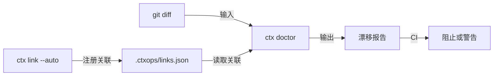

<p align="right">
  <a href="./README.md">🇺🇸 English</a>
</p>

# ctxops

**面向 AI 编码团队的上下文完整性引擎。**

你的 AI 编码工具的表现取决于它消费的上下文质量。`ctxops` 在 PR 中检测文档与代码的漂移，确保 AI 永远不会基于过期的上下文工作。

## 问题

AI 编码工具越来越强，但团队级开发仍然在过期上下文上翻车：

- 架构规则散落在 Wiki、Slack 和个人经验中 —— AI 无法触达
- 文档静默腐烂 —— 持续误导 AI 输出（[Chroma Research](https://research.trychroma.com/context-rot)）
- `AGENTS.md`、`CLAUDE.md`、Copilot 指令各自漂移
- 没有人知道代码变更会影响哪些文档

**结果**：AI 让代码产出快了 20%，但事故率上升 23.5%（[Cortex 2026 基准报告](https://www.cortex.io/post/ai-is-making-engineering-faster-but-not-better-state-of-ai-benchmark-2026)）。

## 快速开始

```bash
# 初始化 ctxops（自动生成 AGENTS.md + Claude Code 技能文件）
npx ctxops init

# 自动发现文档-代码关联（零配置）
npx ctxops link --auto

# 在 PR 中检测漂移
npx ctxops doctor --base main
```

## 功能演示

在 PR 阶段**检测**上下文漂移 —— 而非等 AI 输出了错误结果之后。

```bash
$ ctx doctor --base main

ctx doctor: checking context integrity against main...

Changed files: 2
Linked documents: 3
Affected documents: 2

🔴 STALE + DRIFTED  docs/ai/modules/order.md
   Last updated: 42 days ago (threshold: 30 days)
   Affected by:
     services/order/handler.ts  +15 -3

🟡 DRIFTED          docs/ai/architecture.md
   Last updated: 5 days ago
   Affected by:
     services/order/handler.ts  +15 -3

✔  SYNCED           docs/ai/modules/inventory.md
   Updated in this PR

Summary: 1 stale, 1 drifted, 1 synced, 1 unaffected
```

## 工作原理

1. **关联（Link）** —— 自动发现或显式指定文档与代码的关联
2. **检测（Doctor）** —— 检测代码变更影响了哪些文档（PR 级漂移检测）
3. **执行（Enforce）** —— 在 CI 中通过 `--mode strict` 强制上下文完整性



## 命令

### `ctx init`

在 git 仓库中初始化 ctxops：

```bash
ctx init
```

自动创建：
- `.ctxops/` —— 配置目录
- `docs/ai/` —— 上下文文档模板
- `AGENTS.md` —— AI Agent 指令（Codex、Gemini CLI 等自动读取）
- `.claude/skills/ctxops/` —— Claude Code 技能（自动加载）

### `ctx link`

创建文档-代码关联：

```bash
ctx link --auto                    # ⭐ 自动发现所有关联（零配置）
ctx link docs/ai/modules/order.md "services/order/**"  # 手动关联
ctx link --list                    # 查看所有关联
ctx link --remove <文档>            # 移除关联
```

#### 5 层智能自动关联

`ctx link --auto` 使用五层推断引擎自动发现文档-代码关联：

| 层 | 方法 | 示例 |
|---|---|---|
| 1. `ctxops` 注释 | `<!-- ctxops: paths=... -->` | 显式声明，最高优先级 |
| 2. 目录约定 | 目录名匹配 | `modules/order.md` → `services/order/**` |
| 3. 内容扫描 | Markdown 中引用的代码路径 | 文档提到 `services/inventory/service.ts` |
| 4. Git 共变分析 | git 历史中一起修改的文件 | 统计关联 |
| 5. 语义匹配 | 类名/函数名 grep 匹配 | 文档提到 `OrderHandler` → 找到定义文件 |

### `ctx doctor --base <分支>`

PR 级上下文漂移检测：

```bash
ctx doctor --base main                    # 文本输出（默认）
ctx doctor --base main --format json      # 机器可读
ctx doctor --base main --format sarif     # GitHub Code Scanning
ctx doctor --base main --mode strict      # 发现漂移则退出码为 1（用于 CI）
```

如果没有 link，`doctor` 会自动发现 —— 真正的零配置。

### `ctx status`

全局上下文健康概览 —— 类似 `git status`：

```bash
ctx status

# 输出：
#   Context Health: ██████████████████████████████ 100%
#   ● Fresh: 5    ● Aging: 1    ● Stale: 0    Total: 6
#
#   ✔  docs/ai/modules/order.md        2d ago  (3 paths)
#   ◐  docs/ai/modules/inventory.md   25d ago  (2 paths)
```

### `ctx coverage`

显示哪些代码目录有上下文文档，哪些缺失：

```bash
ctx coverage

# 输出：
#   Context Coverage: ████████████████████░░░░░░░░░░ 67%
#   4/6 code directories have linked context docs
#
#   Covered:
#     ✔ services/order
#     ✔ services/inventory
#   Uncovered:
#     ✖ services/payment  ← 需要上下文文档
```

### `ctx hook`

管理 git pre-commit 钩子：

```bash
ctx hook install    # 安装 pre-commit 钩子
ctx hook remove     # 移除钩子
ctx hook            # 查看状态
```

钩子在每次提交前运行 `ctx doctor --mode warn`。

## AI Agent 集成

`ctx init` 自动生成 AI 编码 Agent 的指令文件：

| Agent | 文件 | 工作方式 |
|---|---|---|
| **Claude Code** | `.claude/skills/ctxops/SKILL.md` | 自动加载为技能 |
| **Codex** (OpenAI) | `AGENTS.md` | 从仓库根目录读取 |
| **Gemini CLI** | `AGENTS.md` | 从仓库根目录读取 |
| **Cursor** | `.claude/skills/` | 复用技能文件 |
| **Cline / OpenCode** | `AGENTS.md` | 从仓库根目录读取 |

### Agent 工作流

```
Agent 收到任务：修改 services/order/handler.ts
  │
  ├→ 1. 写代码前：npx ctxops doctor --base main --format json
  │     发现 order.md 漂移 → 读取但与代码交叉验证
  │
  ├→ 2. 修改代码
  │
  ├→ 3. 写代码后：npx ctxops doctor --base main
  │     检测到漂移 → 自动更新 order.md
  │
  └→ 4. 一个 commit 包含代码 + 文档更新 → doctor 显示 SYNCED ✅
```

无需 MCP Server、无需 SDK、无需额外配置。Agent 直接执行命令即可。

## CI 集成

### GitHub Actions

```yaml
name: Context Integrity
on: [pull_request]
jobs:
  check:
    runs-on: ubuntu-latest
    steps:
      - uses: actions/checkout@v4
        with:
          fetch-depth: 0
      - run: npx ctxops doctor --base ${{ github.event.pull_request.base.ref }} --mode strict
```

## Convention-First 元数据

无 YAML。无 Frontmatter。只写 Markdown。

元数据从目录结构**自动推断**：

| 路径 | 推断的 Scope |
|---|---|
| `docs/ai/modules/order.md` | `module` |
| `docs/ai/playbooks/bugfix.md` | `playbook` |
| `docs/ai/architecture.md` | `project` |

需要覆盖？使用 HTML 注释（可选）：

```markdown
<!-- ctxops: scope=module, paths=services/order/** -->

# 订单模块

（正常的 Markdown 内容 —— 不需要 frontmatter）
```

## 它不是什么

- **不是编码 Agent** —— 它是编码 Agent 依赖的底层
- **不是云服务** —— CLI 优先，仓库本地，版本可控
- **不是文档生成器** —— 它检查完整性，而非生成内容

## 设计哲学

不要再造一个编码 Agent。构建每个编码 Agent 都依赖的上下文完整性层。

## 许可证

Apache-2.0
