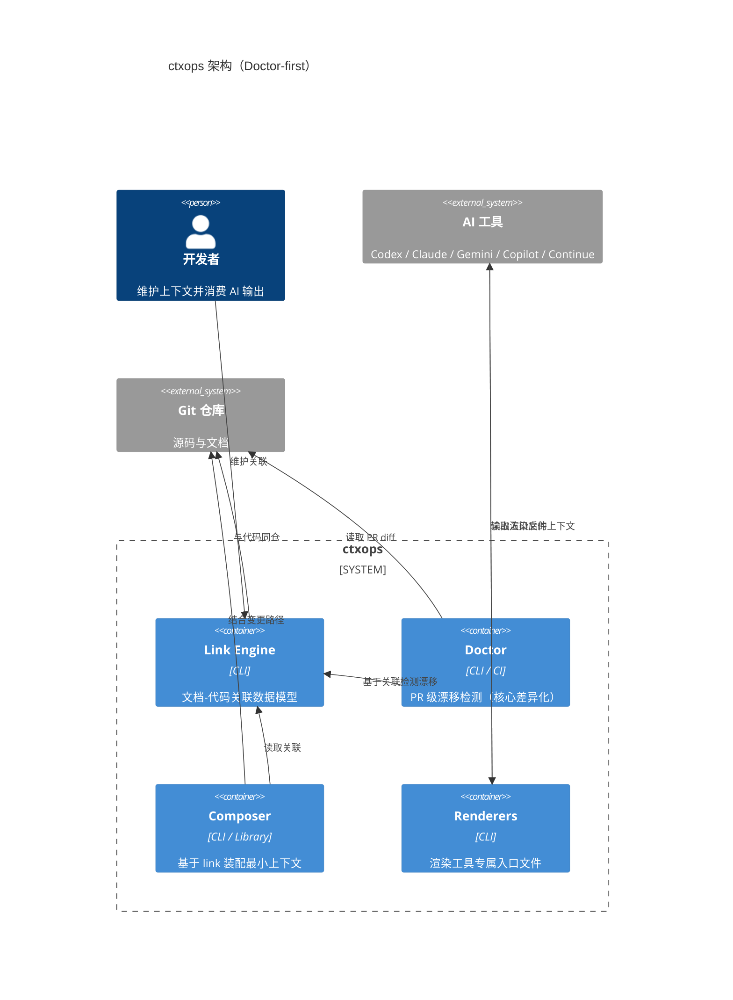

# ctxops 产品 PRD

## 项目命名

名称：`ctxops`（已裁定，见 ADR-0001、ADR-0002）

## 一句话定位

面向 AI 编码工具的 Context Integrity Engine。

> ctxops — The Context Integrity Engine for AI Coding Teams.
> 让你的 AI 只吃到经过校验的、最新的、与代码同步的上下文。在 PR 中自动检测上下文漂移，一行命令同步到所有 AI 入口。

## 问题定义

团队在使用 AI 做研发时，真正的难点不是模型不会写代码，而是：

- 仓库知识分散在代码、Wiki 和个人经验中
- 不同 AI 工具有不同入口格式
- 不同任务需要不同上下文，但多数团队只有静态文档
- 文档一旦过期，就会稳定地产生错误输出（Context Rot，已被 Chroma Research 量化验证）

## 核心产品形态（Doctor-first）

经 CCG 三角评审确认（ADR-0002），ctxops 的核心差异化是 **PR 级上下文完整性检测**，而非上下文装配。

产品核心逻辑：代码变更 → 漂移检测 → AI 输出改善。

### 能力优先级

| 优先级 | 命令 | 阶段 | 定位 |
|---|---|---|---|
| 1 | `ctx doctor --base main` | MVP | **核心差异化**：PR diff → 漂移片段检测 |
| 2 | `ctx link <doc> <paths...>` | MVP | **数据模型**：显式文档-代码关联 |
| 3 | `ctx init` | MVP | 脚手架 + 引导注释 |
| 4 | `ctx compose --changed` | Phase 1 | 基于 link 关联装配 |
| 5 | `ctx render --target agents\|claude` | Phase 1 | 输出到 AGENTS.md / CLAUDE.md |
| 6 | `ctx validate` | Phase 1 | schema 校验 |

## 目标用户

### 第一阶段核心用户

- 中大型仓库维护者
- 统一 AI 研发流程的平台团队
- 希望降低外部贡献者上手成本的开源项目维护者

### 第一阶段非核心用户

- 个人独立开发者
- 云端采购型企业客户

## 产品边界

### 要做的

- 在 PR 中自动检测代码变更影响的上下文漂移（doctor）
- 定义文档与代码的显式关联关系（link）
- 按变更范围装配最小上下文（compose）
- 渲染到多种 AI 工具入口（render）
- 与 CI 集成

### 不做的

- 不做代码生成模型
- 不做云端平台
- 不做自主 agent runtime
- 不做完整 IDE 套件

## 推荐架构



## 技术栈

TypeScript + Node 22 + pnpm（已裁定，ADR-0002 无异议）。

## 仓库结构建议

```text
ctxops/
  apps/
    cli/
  packages/
    core/
    link/
    doctor/
    composer/
    renderers/
    freshness/
    git/
    secrets/
  adapters/
    codex/
    claude/
    gemini/
    copilot/
    continue/
  examples/
    java-spring-monolith/
    ts-monorepo/
  docs/
    architecture/
    adr/
    spec/
```

## 数据模型（Convention-first + Explicit Override）

经 CCG 评审确认（ADR-0002 D3），metadata 策略为：

- **推断为默认值**：从路径结构、文件名、git 历史自动推断元数据
- **显式声明可选**：在 Markdown 中用 `<!-- ctxops: ... -->` 覆盖推断值
- **禁止强制 metadata**：用户只需写 Markdown 内容，不需要写任何 YAML/JSON/Frontmatter

### 推断规则示例

| 元数据 | 推断来源 |
|---|---|
| scope | 文件路径（`docs/ai/modules/` → module） |
| task_types | 文件名（`playbooks/bugfix.md` → bugfix） |
| freshness | git blame（fragment 最后修改时间） |
| paths | 目录约定或显式 `<!-- ctxops: paths=... -->` |

### 显式覆盖示例

```markdown
<!-- ctxops: scope=module, paths=services/order/** -->

# 订单模块上下文

（正常的 Markdown 内容，不需要 frontmatter）
```

## v0.1 必须具备的能力

- `ctx init`（脚手架 + 引导注释）
- `ctx link`（文档-代码关联）
- `ctx doctor --base`（PR 级漂移检测）

## 风险登记

### 风险 A：维护者 Burnout

如果 ctxops 最终只是让用户多了一个需要维护的文件，项目本身违反了自己的价值主张。对策：让维护成为 PR workflow 的副作用，而非额外负担。

### 风险 B：IDE 原生集成吞没

如果 Cursor/Copilot 下个版本原生支持上下文 freshness 检测，核心价值被吞掉。对策：差异化建立在跨工具的统一 integrity 视图上。

### 风险 C：大模型无限上下文窗口（Infinite Context Death）

概率：短期 10%，中长期 40%。如果上下文窗口达 100M+，用户直接塞全库。对策：从一开始建立可量化的价值证明。

## STRIDE

### 信息泄露

- 风险：敏感内容被渲染进入口文件
- 缓解：secret scan、路径 denylist、渲染前脱敏

### 篡改

- 风险：恶意或过期片段污染最终上下文
- 缓解：allowlist 路径、import 校验、traceability

### 拒绝服务

- 风险：递归引用或超大上下文图导致性能下降
- 缓解：递归检测、token 预算、最大深度、缓存

## ADR

见 `adr/ADR-0001-ctxops-direction.md`（项目方向）和 `adr/ADR-0002-doctor-first-pivot.md`（doctor-first 转向 + Context Integrity 品牌）。
