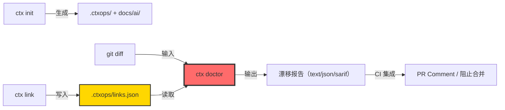
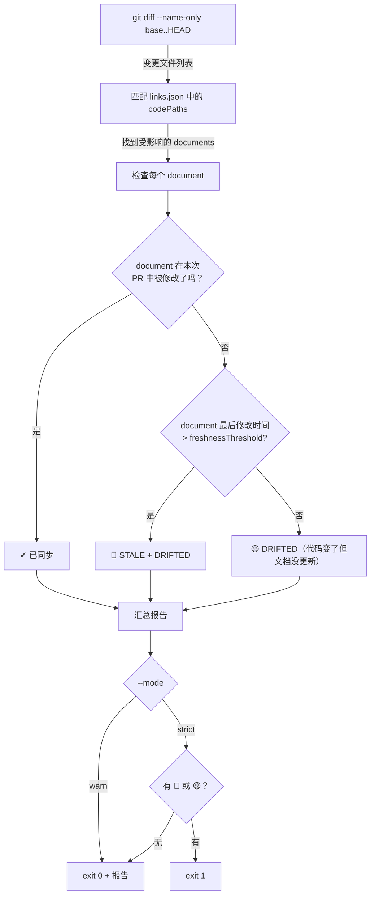
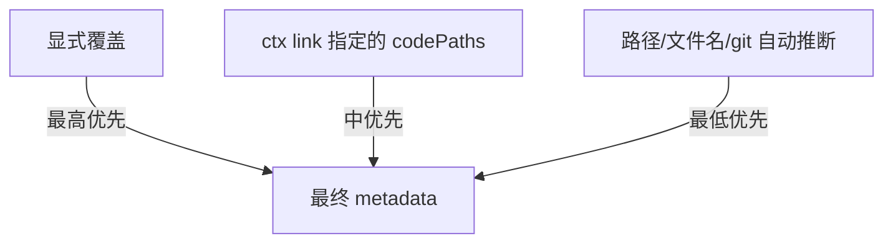

# ctxops MVP 使用规格说明书

版本：v0.1.0-spec
日期：2026-04-25
状态：实现前规格（以此为验收基准）

---

## 一、全局概览

### 产品定位一句话

> ctxops — The Context Integrity Engine for AI Coding Teams.
> 在 PR 中自动检测上下文漂移，确保 AI 只吃到与代码同步的上下文。

### MVP 命令清单

| 命令 | 用途 | 核心用户 |
|---|---|---|
| `ctx init` | 初始化 ctxops 项目结构 | 首次接入的维护者 |
| `ctx link` | 建立文档-代码关联 | 维护者 |
| `ctx doctor` | PR 级上下文漂移检测 | CI/CD + 维护者 |

### 核心数据流



---

## 二、命令详细规格

### 2.1 `ctx init`

#### 用途

在当前 git 仓库中初始化 ctxops 项目结构。一次性操作。

#### 语法

```bash
ctx init [--force] [--template <name>]
```

#### 参数

| 参数 | 必填 | 默认值 | 说明 |
|---|---|---|---|
| `--force` | 否 | false | 覆盖已存在的 `.ctxops/` 目录 |
| `--template` | 否 | `default` | 模板名（`default`、`spring`、`monorepo`） |

#### 前置条件

- 当前目录是一个 git 仓库（存在 `.git/`）

#### 执行行为

1. 检测是否在 git 仓库中，否则报错退出
2. 如果 `.ctxops/` 已存在且未指定 `--force`，报错退出
3. 创建以下目录和文件结构

#### 输出文件结构

```text
.ctxops/
  config.json          # ctxops 配置
  links.json           # 文档-代码关联注册表（空数组）

docs/ai/
  00-project-overview.md   # 项目概览模板（含引导注释）
  01-architecture.md       # 架构说明模板
  modules/                 # 模块级上下文目录
    _example.md            # 示例模块文档（含 ctxops 注释演示）
  playbooks/               # 任务剧本目录
    _example-bugfix.md     # 示例 bugfix 剧本
```

#### `.ctxops/config.json` 格式

```json
{
  "version": "0.1.0",
  "contextDir": "docs/ai",
  "linksFile": ".ctxops/links.json",
  "doctor": {
    "freshnessThresholdDays": 30,
    "defaultMode": "warn"
  },
  "inference": {
    "scopeFromPath": true,
    "taskTypeFromFilename": true,
    "freshnessFromGit": true
  }
}
```

#### `.ctxops/links.json` 初始格式

```json
{
  "version": "0.1.0",
  "links": []
}
```

#### 示例模板文件 `docs/ai/modules/_example.md`

```markdown
<!-- ctxops: scope=module, paths=services/example/** -->

# 示例模块上下文

> 这是一个 ctxops 上下文片段示例。
> 删除本文件并创建你自己的模块文档。

## 模块职责

（描述本模块的核心职责和边界）

## 关键接口

（列出其他模块可能依赖的关键接口）

## 常见陷阱

（AI 容易犯的错误，或模块特有的约束）
```

#### 终端输出示例

```
✔ Initialized ctxops in /Users/dev/my-project

Created:
  .ctxops/config.json      — configuration
  .ctxops/links.json       — link registry (empty)
  docs/ai/                 — context fragments directory
  docs/ai/modules/_example.md — example module template

Next steps:
  1. Edit docs/ai/00-project-overview.md with your project info
  2. Run: ctx link docs/ai/modules/order.md services/order/**
  3. Run: ctx doctor --base main
```

#### 退出码

| 码 | 含义 |
|---|---|
| 0 | 成功 |
| 1 | 不在 git 仓库中 |
| 2 | `.ctxops/` 已存在（未指定 --force） |

---

### 2.2 `ctx link`

#### 用途

建立文档与代码路径的显式关联。这是 ctxops 数据模型的核心。

#### 语法

```bash
ctx link <document> <code-paths...>
ctx link --remove <document>
ctx link --list [--format text|json]
```

#### 参数

| 参数 | 必填 | 说明 |
|---|---|---|
| `<document>` | 是 | 上下文文档路径（相对于仓库根目录） |
| `<code-paths...>` | 是（link 模式） | 一个或多个代码路径（支持 glob） |
| `--remove` | 否 | 移除指定文档的关联 |
| `--list` | 否 | 列出所有关联 |
| `--format` | 否 | 输出格式（`text` 或 `json`，默认 `text`） |

#### 前置条件

- `.ctxops/links.json` 存在（已执行 `ctx init`）
- `<document>` 文件存在
- `<code-paths>` 至少有一个路径在仓库中存在（或是有效 glob）

#### 执行行为

**link 模式**：
1. 验证 document 文件存在
2. 验证至少一个 code-path 匹配到实际文件
3. 解析 document 中的 `<!-- ctxops: ... -->` 注释（如有），提取显式元数据
4. 推断默认元数据（scope 从路径，freshness 从 git blame）
5. 写入 `.ctxops/links.json`
6. 如果该 document 已有关联，更新（不重复）

**remove 模式**：
1. 从 `.ctxops/links.json` 中移除该 document 的所有关联

**list 模式**：
1. 读取 `.ctxops/links.json` 并格式化输出

#### links.json 数据模型

```json
{
  "version": "0.1.0",
  "links": [
    {
      "document": "docs/ai/modules/order.md",
      "codePaths": ["services/order/**", "shared/models/order.ts"],
      "metadata": {
        "scope": "module",
        "taskTypes": ["bugfix", "feature"],
        "inferredFrom": "path",
        "overrides": {
          "paths": "services/order/**"
        }
      },
      "lastLinked": "2026-04-25T14:00:00Z"
    }
  ]
}
```

#### 终端输出示例

**link 操作**：
```
✔ Linked: docs/ai/modules/order.md
  → services/order/**
  → shared/models/order.ts
  Scope: module (inferred from path)
  Freshness: 12 days (from git blame)
```

**list 操作**：
```
DOCUMENT                          CODE PATHS                    SCOPE    FRESHNESS
docs/ai/modules/order.md          services/order/**             module   12 days
                                  shared/models/order.ts
docs/ai/modules/inventory.md      services/inventory/**         module   45 days ⚠
docs/ai/01-architecture.md        services/**                   project  3 days
```

#### 退出码

| 码 | 含义 |
|---|---|
| 0 | 成功 |
| 1 | `.ctxops/` 不存在（未 init） |
| 2 | document 文件不存在 |
| 3 | 没有 code-path 匹配到实际文件 |

---

### 2.3 `ctx doctor --base`

#### 用途

**核心差异化命令**。对比 base branch 的 diff，检测哪些上下文文档受到代码变更影响但未同步更新。

#### 语法

```bash
ctx doctor --base <branch> [--format text|json|sarif] [--mode warn|strict] [--ci]
```

#### 参数

| 参数 | 必填 | 默认值 | 说明 |
|---|---|---|---|
| `--base` | 是 | — | 基准分支（通常是 `main` 或 `develop`） |
| `--format` | 否 | `text` | 输出格式 |
| `--mode` | 否 | 从 config.json 读取 | `warn`=只报告，`strict`=发现漂移则返回非零退出码 |
| `--ci` | 否 | false | CI 模式：输出适配 GitHub Actions annotation 格式 |

#### 前置条件

- `.ctxops/links.json` 存在且有至少一个 link
- 当前分支不是 base 分支（有 diff）
- git 可用

#### 核心算法



#### 检测逻辑详解

**Step 1：获取变更文件**
```bash
git diff --name-only <base>..HEAD
```
→ 得到变更文件列表，如 `["services/order/handler.ts", "services/order/model.ts"]`

**Step 2：匹配关联**
遍历 `links.json` 中每个 link，检查其 `codePaths` 是否 match 任何变更文件（glob 匹配）。

**Step 3：检查 document 同步状态**
对于每个受影响的 document：
- 检查 document 是否在当前 PR 的 diff 中（`git diff --name-only` 中是否包含该 document 路径）
- 检查 document 最后修改时间（`git log -1 --format=%ci <document>`）
- 计算距今天数

**Step 4：生成诊断**

| 状态 | 条件 | 严重度 |
|---|---|---|
| ✔ SYNCED | document 在本次 PR 中被修改 | 无 |
| 🟡 DRIFTED | 代码路径变了，document 没在 PR 中修改，但 freshness 未超阈值 | warning |
| 🔴 STALE + DRIFTED | 代码路径变了，document 没在 PR 中修改，且 freshness 超过阈值 | error |
| 🟢 UNAFFECTED | document 关联的代码路径未在本次 PR 中变更 | 无 |

#### 输出格式

**text 格式（人类可读）**：
```
ctx doctor: checking context integrity against main...

Changed files: 4
Linked documents: 6
Affected documents: 3

🔴 STALE + DRIFTED  docs/ai/modules/order.md
   Last updated: 42 days ago (threshold: 30 days)
   Affected by:
     services/order/handler.ts  (+15 -3)
     services/order/model.ts    (+8 -2)
   Impact: Referenced by AGENTS.md, CLAUDE.md

🟡 DRIFTED          docs/ai/01-architecture.md
   Last updated: 5 days ago
   Affected by:
     services/order/handler.ts  (+15 -3)

✔  SYNCED           docs/ai/modules/inventory.md
   Updated in this PR

Summary: 1 stale, 1 drifted, 1 synced, 3 unaffected
```

**json 格式（程序消费）**：
```json
{
  "base": "main",
  "head": "feature/update-order",
  "changedFiles": 4,
  "linkedDocuments": 6,
  "results": [
    {
      "document": "docs/ai/modules/order.md",
      "status": "stale_drifted",
      "severity": "error",
      "lastUpdated": "2026-03-14T10:00:00Z",
      "daysSinceUpdate": 42,
      "freshnessThreshold": 30,
      "affectedBy": [
        {"file": "services/order/handler.ts", "additions": 15, "deletions": 3},
        {"file": "services/order/model.ts", "additions": 8, "deletions": 2}
      ]
    },
    {
      "document": "docs/ai/01-architecture.md",
      "status": "drifted",
      "severity": "warning",
      "lastUpdated": "2026-04-20T10:00:00Z",
      "daysSinceUpdate": 5,
      "freshnessThreshold": 30,
      "affectedBy": [
        {"file": "services/order/handler.ts", "additions": 15, "deletions": 3}
      ]
    }
  ],
  "summary": {
    "stale": 1,
    "drifted": 1,
    "synced": 1,
    "unaffected": 3
  }
}
```

**sarif 格式（GitHub Code Scanning）**：
符合 SARIF v2.1.0 标准，可直接上传到 GitHub Code Scanning。

#### GitHub Actions 集成示例

```yaml
name: Context Integrity Check
on: [pull_request]

jobs:
  ctx-doctor:
    runs-on: ubuntu-latest
    steps:
      - uses: actions/checkout@v4
        with:
          fetch-depth: 0  # 需要完整 git 历史
      - uses: actions/setup-node@v4
        with:
          node-version: 22
      - run: npx ctxops doctor --base ${{ github.event.pull_request.base.ref }} --format sarif --mode strict > results.sarif
      - uses: github/codeql-action/upload-sarif@v3
        with:
          sarif_file: results.sarif
```

#### 退出码

| 码 | 含义 |
|---|---|
| 0 | 无漂移，或 warn 模式下有漂移但不阻止 |
| 1 | strict 模式下发现漂移（🟡 或 🔴） |
| 2 | 配置错误（缺少 links.json 等） |

---

## 三、Convention-first Metadata 推断规则

### 推断优先级



### 详细推断规则

| 元数据字段 | 推断逻辑 | 示例 |
|---|---|---|
| `scope` | 路径层级：`docs/ai/modules/` → module；`docs/ai/playbooks/` → playbook；`docs/ai/` 根 → project | `docs/ai/modules/order.md` → scope=module |
| `taskTypes` | 文件名关键词：bugfix/feature/review/refactor → 对应 task type | `playbooks/bugfix.md` → taskTypes=["bugfix"] |
| `freshness.lastModified` | `git log -1 --format=%ci <file>` | 2026-04-20T10:00:00Z |
| `freshness.daysSinceUpdate` | 当前日期 - lastModified | 5 |
| `codePaths` | 来自 `ctx link` 或 `<!-- ctxops: paths=... -->` | services/order/** |

### 显式覆盖语法

在 Markdown 文件中使用 HTML 注释，位于文件顶部（第一个 heading 之前）：

```markdown
<!-- ctxops: scope=module, paths=services/order/**, freshness.review_after_days=14 -->

# 订单模块上下文

（正常内容...）
```

支持的覆盖字段：
- `scope`：module | project | playbook | custom
- `paths`：glob 表达式，逗号分隔
- `freshness.review_after_days`：自定义新鲜度阈值

---

## 四、完整使用场景演示

### 场景：Java Spring 项目接入 ctxops

#### Step 1：初始化

```bash
cd my-spring-project
npx ctxops init
```

输出：
```
✔ Initialized ctxops in /Users/dev/my-spring-project
```

#### Step 2：创建模块文档并建立关联

```bash
# 编写模块文档
cat > docs/ai/modules/order.md << 'EOF'
<!-- ctxops: scope=module -->

# 订单模块

## 模块职责
处理订单创建、支付、取消的完整生命周期。

## 关键约束
- 订单状态机：CREATED → PAID → SHIPPED → COMPLETED
- 取消只允许在 PAID 之前
- 库存扣减在 PAID 时触发，通过 inventory-service 的 gRPC 接口

## 常见陷阱
- ❌ 不要直接操作 inventory 表，必须通过 inventory-service
- ❌ 不要跳过状态机步骤，状态变更必须经过 OrderStateMachine
EOF

# 建立关联
npx ctxops link docs/ai/modules/order.md services/order/**
npx ctxops link docs/ai/modules/order.md shared/models/order.ts
```

#### Step 3：检查关联

```bash
npx ctxops link --list
```

输出：
```
DOCUMENT                          CODE PATHS                    SCOPE    FRESHNESS
docs/ai/modules/order.md          services/order/**             module   0 days
                                  shared/models/order.ts
```

#### Step 4：日常开发 — PR 中运行 doctor

开发者在 feature branch 修改了 `services/order/handler.ts`：

```bash
npx ctxops doctor --base main
```

输出：
```
ctx doctor: checking context integrity against main...

Changed files: 1
Linked documents: 1
Affected documents: 1

🟡 DRIFTED          docs/ai/modules/order.md
   Last updated: 12 days ago
   Affected by:
     services/order/handler.ts  (+25 -8)

Summary: 0 stale, 1 drifted, 0 synced
Suggestion: Review docs/ai/modules/order.md and update if needed.
```

#### Step 5：45 天后另一个开发者改了同一模块

```bash
npx ctxops doctor --base main --mode strict
```

输出：
```
ctx doctor: checking context integrity against main...

🔴 STALE + DRIFTED  docs/ai/modules/order.md
   Last updated: 45 days ago (threshold: 30 days)
   Affected by:
     services/order/payment-handler.ts  (+40 -12)
   Impact: This document hasn't been updated in 45 days and the
           code it covers has been significantly modified.

Summary: 1 stale, 0 drifted, 0 synced

❌ Context integrity check failed (strict mode).
   1 document requires attention before merge.
```

退出码 = 1，CI 阻止合并。

---

## 五、安装与分发

### npm 安装

```bash
# 全局安装
npm install -g ctxops

# 项目本地安装
npm install -D ctxops

# 一次性使用
npx ctxops <command>
```

### CLI 入口

```bash
ctx <command>    # 如果全局安装
npx ctxops <command>  # 如果 npx 使用
```

### 帮助

```bash
ctx --help
ctx init --help
ctx link --help
ctx doctor --help
```

---

## 六、项目结构约定

### 最小可工作结构

```text
my-project/
  .git/
  .ctxops/
    config.json
    links.json
  docs/ai/
    modules/
      order.md
    playbooks/
      bugfix.md
  services/
    order/
      handler.ts
  AGENTS.md          # Phase 1: ctx render 生成
  CLAUDE.md          # Phase 1: ctx render 生成
```

### 推荐目录结构

```text
docs/ai/
  00-project-overview.md     # scope=project
  01-architecture.md         # scope=project
  02-domain-glossary.md      # scope=project
  modules/                   # scope=module（自动推断）
    order.md
    inventory.md
    payment.md
  playbooks/                 # scope=playbook（自动推断）
    bugfix.md
    feature.md
    review.md
```
