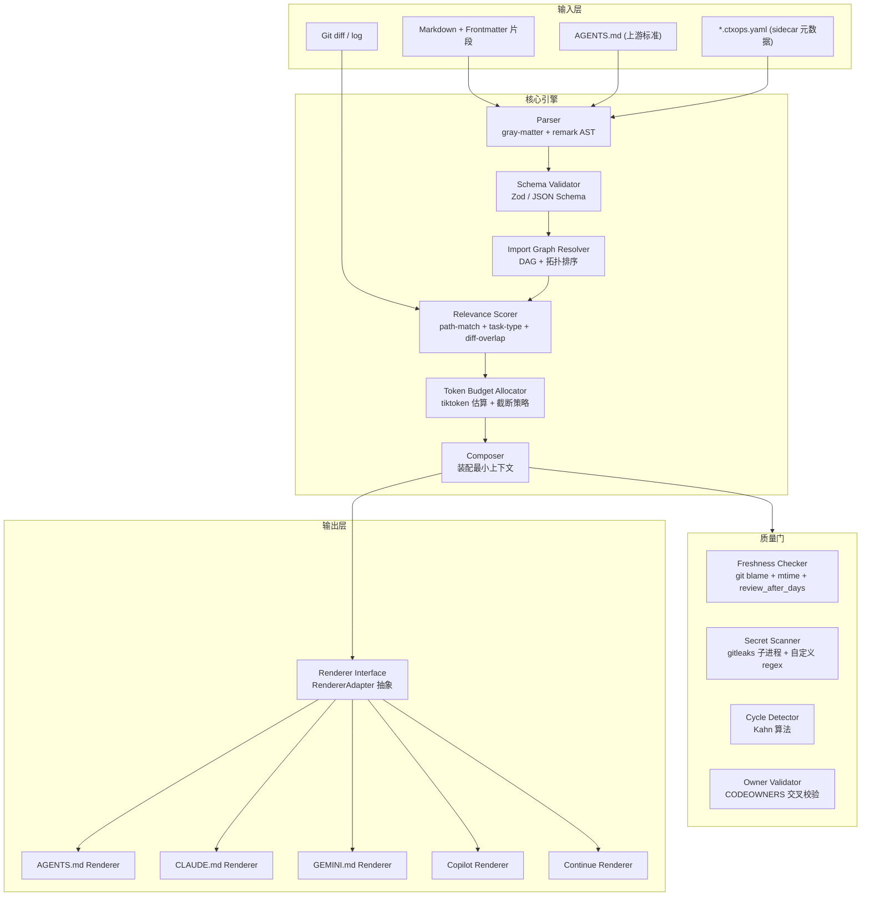

# 03 — 架构与工程可行性评估

报告日期：2026-04-25
分析视角：技术架构师 — 设计可行性
输入文档：PRD (03)、Roadmap (05)、需求分析 (08)、全量项目文档

---

## 架构总览



---

## 1. 核心技术挑战

### 1.1 上下文片段格式：AGENTS.md 扩展 vs 自定义 frontmatter

**结论：必须做 AGENTS.md 的 progressive enhancement，不能平行造格式。**

需求分析已明确指出：AGENTS.md 被 60,000+ 仓库采用，由 Linux Foundation 旗下 Agentic AI Foundation 接管。如果 ctxops 发明一套平行的 frontmatter schema，用户需要同时维护两套元数据，采纳摩擦极高。

**具体工程方案**：
- 主格式：标准 AGENTS.md Markdown 文件，零 ctxops 专属语法
- 扩展元数据：通过 sidecar 文件 `*.ctxops.yaml` 或 HTML 注释 `<!-- ctxops: {...} -->` 注入 `scope`、`priority`、`task_types`、`freshness` 等字段
- **难点量化**：HTML 注释解析需要自定义 remark plugin，成本约 200-400 行代码；sidecar 方案则需要路径映射逻辑（片段文件 → sidecar 文件 1:1 或 N:1），约 150 行。**sidecar 方案工程成本更低且不侵入原文件，推荐 MVP 阶段采用**

### 1.2 任务级装配的核心算法

PRD 定义的 compose 命令签名是 `ctx compose --task bugfix --path services/order --diff HEAD~1..HEAD`。这需要一个**多信号相关性评分器**。

**Step 1 — 候选收集**：遍历所有片段，解析 frontmatter/sidecar，建立 `Fragment[]` 索引。复杂度 O(n)，n = 片段数。中型项目约 50-200 片段，无性能问题。

**Step 2 — 相关性评分**：对每个 Fragment 计算加权分数：

```
score(f) = w1 * pathMatch(f.paths, --path)
         + w2 * taskMatch(f.task_types, --task)
         + w3 * diffOverlap(f.paths, changedFiles(--diff))
         + w4 * f.priority / 100
         + w5 * importDepth(f)
```

- **pathMatch**：glob 匹配（micromatch），需引入 specificity 分级（精确路径 > 目录 glob > 通配符）
- **diffOverlap**：将 `git diff --name-only` 的文件列表与 fragment.paths 做交集。难点：rename detection 需 `--diff-filter=R`
- **taskMatch**：MVP 建议严格枚举 + `other` 兜底

**Step 3 — Token budget 裁剪**：按 score 降序贪心装入直到逼近 budget。tiktoken (cl100k_base) 对中文 Markdown 误差可达 15-20%，建议预留 10% buffer。

### 1.3 多渲染目标的差异点与抽象层设计

| 维度 | AGENTS.md | CLAUDE.md | GEMINI.md | Copilot | Continue |
|------|-----------|-----------|-----------|---------|----------|
| 文件位置 | 项目根 / 子目录 | 项目根 + ~/.claude/CLAUDE.md | 项目根 | .github/copilot-instructions.md | .continue/rules/*.md |
| 层级模型 | 目录级继承 | 全局 + 项目两层 | 单文件 | 单文件 | 多文件规则集 |
| 特殊语法 | 无 | `<details>` 折叠块 | 无 | 无 | frontmatter `description` |
| Token 限制 | 无（推荐 < 8k） | 无（实测 > 50k 仍有效） | ~32k | ~8k | 单文件 ~4k |

**抽象层**：

```typescript
interface RendererAdapter {
  readonly id: string;
  readonly outputPaths: OutputPathSpec;
  readonly tokenLimit: number | null;
  readonly supportsHierarchy: boolean;
  render(composed: ComposedContext): RenderedFile[];
}
```

**难点**：AGENTS.md 的目录级继承需要 merge 策略（append / replace / section-patch）。MVP 只做 replace 整文件，Phase 1 再做 section-level patch。

### 1.4 Freshness / Staleness 检测的可信度

三层递进方案：

- **L1 — 路径存在性检测**（可信度 100%，**MVP 必做**）：fragment.paths 是否在仓库中存在，使用 `fs.stat` + glob 展开
- **L2 — 时间衰减检测**（可信度 80%）：`review_after_days` 与 `git log` 对比；改进方案是对 fragment.paths 指向的代码文件也做 mtime 检查
- **L3 — 语义陈旧检测**（可信度 30-50%，**MVP 不做**）：本质是 NLU + code understanding 问题。替代方案：要求声明 `anchors: ["class:OrderService", "method:placeOrder"]`，doctor 用 AST grep 验证

### 1.5 Secret Scanning：gitleaks 调用 vs 自实现

**结论：MVP 调用 gitleaks，不自实现。**

- gitleaks 维护 800+ 条规则，自实现同等覆盖度需 2000+ 行正则 + 持续维护
- 调用方式：`spawn('gitleaks', ['detect', '--source', tempDir, '--report-format', 'json'])`
- 降级方案：gitleaks 不在 PATH 时，启用内置的 10-20 条高频规则（AWS key、GitHub PAT、generic password）
- 性能：扫描 1MB Markdown 约 200ms，可接受

### 1.6 Import 图与递归检测

DAG 校验使用 Kahn 算法做拓扑排序，O(V+E)。环路径报告需额外 DFS + 回溯栈。

**Token budget 计算**是 DAG 上的 DP 问题。难点：diamond dependency（A→B,C，B,C→D）。建议 compose 时 D 去重，budget 按去重后计算。**Budget 检查必须 per-target**（Claude 200k vs Copilot 8k）。

---

## 2. 推荐技术栈

### 详细对比

| 维度 | TypeScript + Node 22 | Bun | Go | Rust |
|------|---------------------------|-----|-----|------|
| Markdown/YAML 生态 | **最强**（remark/unified） | 兼容 Node | goldmark 够用但生态薄 | pulldown-cmark 够用 |
| CLI 框架 | commander/yargs/oclif 成熟 | 同 Node | cobra 极成熟 | clap 极成熟 |
| 启动速度 | ~150ms | ~30ms | ~5ms | ~3ms |
| 分发 | npm + pkg/sea 打包 | 单文件 binary | 单文件 binary（天然） | 单文件 binary |
| 贡献者门槛 | **最低** | 较低 | 中等 | **最高** |

### 推荐：TypeScript + Node 22 + pnpm monorepo

**核心理由**：

1. **Markdown 处理是本项目 70% 工作量**。remark/unified 生态在 AST 操作、自定义变换上无可替代。Go/Rust 一旦需要自定义 AST 变换（section-level merge、HTML 注释提取、token 级截断），生态差距拉大到数倍开发成本。
2. **目标用户接受度**。Java 团队对 TS CLI 的顾虑用 `pkg`/`bun build --compile`/`node --experimental-sea` 做单文件 binary 解决。
3. **贡献者漏斗最宽**。开源项目核心资产是社区贡献，TS 开发者池是 Rust 的 10 倍以上。

**反对意见（必须承认）**：
- Node 22 冷启动 150ms 在 git hook 场景有体感。Phase 2 可平滑迁移到 Bun（API 兼容 > 95%）
- pkg 打包 binary 约 40-60MB，Go 约 8-15MB
- TS 类型安全弱于 Rust，schema 校验依赖 Zod 运行时

**Bun 作为 Phase 1 升级路径**：第一天起避免 Node-only native addon。

---

## 3. MVP 边界：v0.1 必做的 5 个最小命令

### `ctx init`（1-2 天）
生成 `.ctxops/config.yaml` + `docs/ai/` 骨架 + 示例片段。**没有 init，第一步漏斗流失 ~40%**。

### `ctx compose --task --path [--diff]`（5-8 天）
读取片段 → 评分 → token budget 裁剪 → 输出装配后 Markdown。**这是唯一爆点，没有它退化为静态模板工具**。约 800-1200 行。

### `ctx render --target agents|claude`（3-4 天）
转换为目标工具入口文件并写入。**MVP 只做 AGENTS.md + CLAUDE.md**，不在 render 广度上正面竞争 rulesync。约 400 行。

### `ctx doctor`（4-5 天）
L1 路径校验 + L2 时间衰减 + 循环 import + token budget + 基础 secret scan。**CI 集成入口，是空档 B 的载体**。约 600 行。

### `ctx validate`（2 天）
单个/全部片段 schema 校验（基于 Zod）。是 doctor 的基础，也是 LSP 前置。约 300 行。

**总 MVP 工作量**：约 2300-2700 行核心代码，14-21 天（1 人），10-14 天（2 人并行）。

---

## 4. 三个有风险的设计决定

### 4.1 frontmatter 是否绑定全部规则
**建议**：分级策略 — 核心 3 字段（id/scope/paths）放 frontmatter，扩展字段（owners/priority/task_types/freshness/security_level）放 sidecar。frontmatter 不超过 5 行。
**风险等级**：中。错误方向是把所有字段塞进 frontmatter 让用户感觉"太重"。

### 4.2 是否做插件机制
**建议**：v0.1 做内置 adapter 模式（接口而非公开 API）。Phase 2（>100 stars）后再定义 plugin contract。
**风险等级**：低-中。真正的风险是过早承诺 plugin API 后被锁死。

### 4.3 是否兼容 AGENTS.md 标准
**建议**：**必须兼容 AGENTS.md**。这不是可选项，而是生存前提。需求分析已把"发明新格式"列为已关闭窗口。
**风险等级**：高。选择平行格式则大概率 6 个月内因采纳率过低失败。

---

## 5. 测试策略（死亡之谷）

最终产物是给 AI 读的 prompt 文本，传统 assert 不够用。三层金字塔：

### L1 — 确定性单元测试（60%）
Schema/Import 图/Path matching/Token counting/Secret detection。**Vitest + 快照**。

### L2 — Render 快照测试（25%）
**结构化比较**：parse rendered Markdown 为 AST，断言 section 标题、代码块数、token 数。允许措辞微调而不破坏测试。

### L3 — AI 效果回归测试（15%）

**方法 A — Prompt Diff Scoring**：维护 5-10 个标准场景，输入 fragments + task params，输出 golden（人工审核）。CI 比较 Jaccard similarity of fragment IDs（应 > 0.8）。

**方法 B — LLM-as-Judge**（Phase 2+）：将 golden 与 actual 同时送 judge LLM 评分，回归条件 actual 不低于 golden - 0.5。Haiku 级模型降本，只在 release 前跑。

**方法 C — 仓库烟雾测试**：在 examples/java-spring-monolith/ 跑全流程，断言无错误退出 + token 数在 budget 内 + 无 secret 泄漏。

---

## 6. 五个架构风险与对策

### 风险 1：compose 评分权重调优黑洞
**对策**：v0.1 硬编码经验权重（pathMatch=0.35, taskMatch=0.25, diffOverlap=0.25, priority=0.10, importDepth=0.05）+ config.yaml override 入口。**收集 5+ 个真实仓库数据后再调优，不要无数据自动调优。**

### 风险 2：AGENTS.md 标准快速演进导致兼容断裂
**对策**：(a) 关注 agentsmd/agents.md RFC；(b) sidecar 设计为 additive-only，原生支持后自动降级读原生字段；(c) 参与标准讨论争取成为 contributor。

### 风险 3：Token 计算多模型不一致
**对策**：(a) Budget 检查 per-target，每个 RendererAdapter 声明自己的 tokenizer；(b) MVP 用 cl100k_base + 20% 安全边际；(c) Phase 1 引入 Claude tokenizer。

### 风险 4：大型 monorepo 性能悬崖
**对策**：(a) `.ctxops/.cache/index.json` 缓存 fragment ID → mtime → token count；(b) import 展开最大深度限制（默认 5 层）；(c) 用 fast-glob（比 node-glob 快 3-5 倍）。

### 风险 5：过度工程化导致 MVP 跳票
**对策**：(a) 严格执行 5 命令清单，其余标 Phase 1+；(b) 每个 PR 关联 P0 issue；(c) 遵循"最晚负责任时刻"原则。

---

## 总结

**推荐技术栈**：TypeScript + Node 22 + pnpm monorepo（核心理由：Markdown 生态最强，贡献者门槛最低，与 AGENTS.md 对齐）。Bun 作为 Phase 1 升级备选。

**MVP 5 命令**：`init` / `compose` / `render` / `doctor` / `validate`。

**两大技术风险**：
1. **compose 评分权重调优黑洞**：唯一差异化但无 ground truth 校准数据。如果默认权重产生差片段选择，用户在其他功能成为问题前就失去信任。
2. **AGENTS.md 标准快速演进**：标准由 OpenAI/Google/Sourcegraph/Cursor/Factory 共同治理。如果原生支持 metadata，sidecar 一夜之间多余。这是无法纯工程层面 de-risk 的战略依赖。
